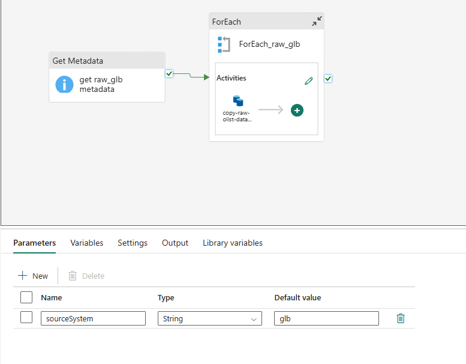
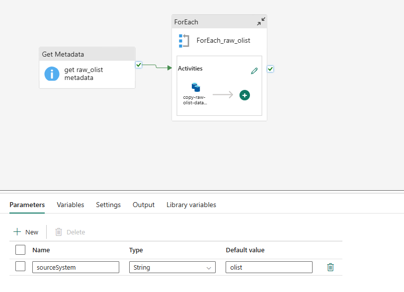
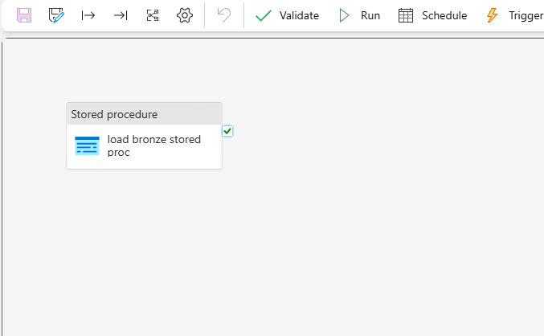
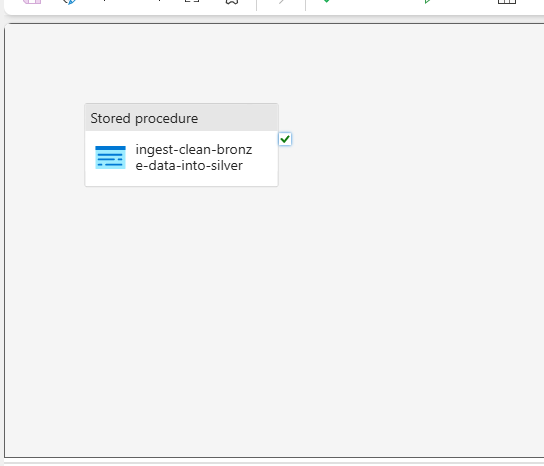
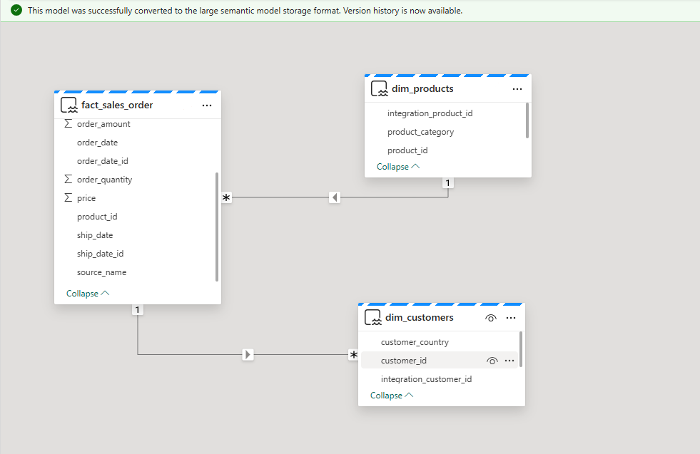
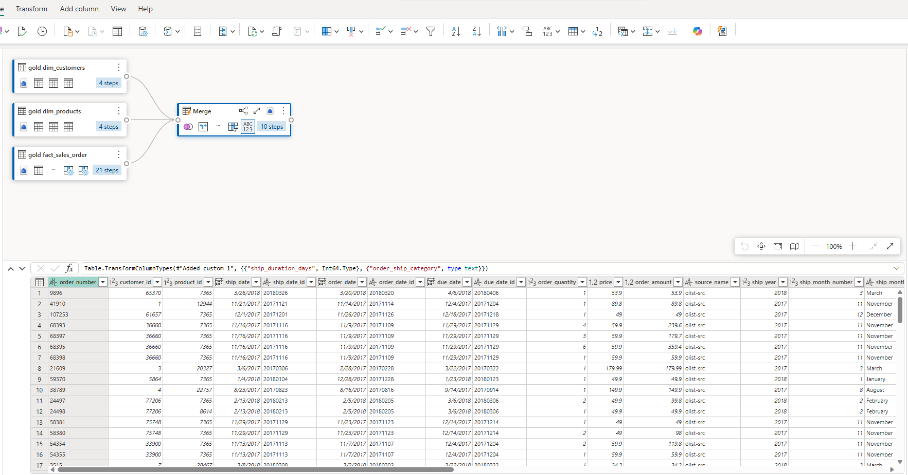
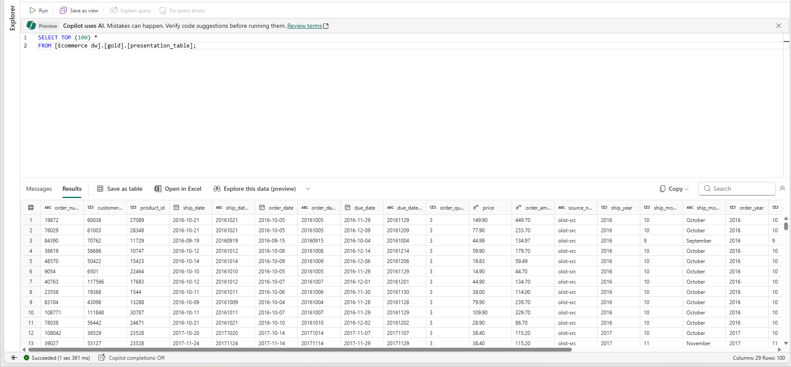

**Microsoft Fabric: E-Commerce Data Warehouse Project**
---
**Project Overview:**

This  project focuses on designing and implementing an end-to-end data warehousing solution using Microsoft Fabric for a global e-commerce environment. Data was sourced from two separate e-commerce systems, olist and glb, each containing customer information, product catalogues, order details, product and customer attributes.

The objective was to integrate these datasets with varying naming conventions and data quality issues into a unified analytics-ready architecture following the medallion (Bronze-silver-gold) framework, enabling clean, consistent and high quality data for business intelligence and advanced analytics.

The solution includes data ingestion, tranformation, modelling, pipeline orchestration, and dashboarding, demonstrating a full modern data platform workflow within Mircosfot fabric.

---
**Business Problem:**

E-commerce companies often collect data data from multiple ystems. However, these systems usually store information in different structure and formats, leading to innconsistent product details, duplicated customers, missing values, and incompatible date and currency formats.
Because of these inconsistencies, it becoes difficult to generate accurate sales reports, understand customer behaviour, or build relaible dashboard for decision-making.

This project addresses a typcial real world challenge: bringing together data from multiple e-commerce sources, resolving quality issues, standardising the structure, and preparing a single trusted dataset for analytics and business intelligence.

---

**Data Source:**

 The dataset was sourced from a public open-data repository. Dataset from the olist source is an official e-commerce dataset from a Brazillian online marketplace, while dataset from the the global source was also sourced from Kaggle and contains a broader collection of customer purchase recrods from multiple countries.

 For the purpose of this project, the dataset from olist sources is been named as 'olist' while the dataset from global source is named as 'glb'.

 ---

 **Architecture Summary**

 - Lakehouse
 - Data Warehouse
 - Data ingestion and transformation using SQL
 - Pipelines
 - Dataflow Gen2
 - Semantic Model
 - Power BI report

---

---

**Solution Approach**

---

**Step 1: Raw Data Ingestion**

The raw ingestion steps copies raw csv data from the lakehouse to the warehouse so it can be standardisied, validated, and processed thorugh the medallion layers.

  - Data copied from lakehouse/raw/olist and lakehouse/raw/glb into the staging schemas stg_olist and stg_glb using each of the pipeline activities: Metadata ---> ForEach ---> Copy
  - A parameter was created for each ingestion
  - csvs are landed in staging layer as a table in the warehouse
 
  ingest from raw_glb to stg_glb             |           ingest from raw_glb to stg_glb            
  :-----------------------------------------:|:------------------------------------------:|
        |   

 
---

**Step 2: Data Ingestion from staging layer to bronze layer**

The second step processes data from staging schemas (stg_olist and stg_raw) and loads each of the csv files into specified tables in the bronze layer.

A dedicated stored procedure, bronze.load_bronze, was developed to orchestrate the transformation and loading logic. This procedure was executed within a faric pipeline to ensure repeatability and automation.

**Tasks:**

      - For each csv dataset, a bronze table was created if it does not already exists using SQL
      - Truncate tables and insert latest staged data
      - Transformation didn't occur in this layer, data was ingested as it was from the source.
      - Stored Procedure: bronze.load_bronze was created within the warehouse environment
      - Pipeline: stored procedure activity was used to ingest data from staging and populate all tables created in the bronze layer
      - Please see the folder in this documentation(script ---> "data ingestion from stg to bronze layer")

  |  ingest from stg_glb and stg_olist to bronze      |                    
  |:-------------------------------------------------:|
  |      |  

---

**Step 3: Silver Layer Transformation**

In this stage, data from the bronze layer is refined into high quality analytical tables within the silver layer.

The silver layer applies business logic, resolves data quality issues, and prepares dataset for dimensional modelling in the gold layer.

A stored procedure named silver.load_silver was created to perform all required transformations. This procedure is executed by a farbic pipeline to ensure consistent, automated data processing.

**Tasks:**

      - Explore each of the dataset in the bronze layer for data quality issues (Please see the folder in this documentation("test-data-quality-checks)
        " ---> "data-quality-checks-bronze-layer")
      - Data cleaning
      - Deduplicate records
      - Standardise name, date and categories
      - Derive additional attributes (e.g., processed_date)
      - For data cleaning/transformation activity, Please see the folder in this documentation(scripts/Bronze ingestion script
        /data cleaning and standardisation)
**Outcome:** Clean dataset from bronze schema were ingested into each of the tables created in the silver layer using a pipeline(stored procedure activity)

  |  ingest from bronze to silver                     |                    
  |:-------------------------------------------------:|
  |           |  

---

**Step 4: Gold Layer - Business-Focused Views**

The gold layer represents the final and most business-oriented stage of the warehouse.

In this layer, consolidated dimension and fact view were created to support semantic modelling and Power BI reporting.

The aim was to deliver a clean, integrated, and business-friendly dataset suitable for analytics

**View Created:**

    
         - gold.dim_customers - consolidated customer attributes
         - gold.dim_products - consolidated product attributes
         - gold.fact_sales_order -  consolidated sales fact table

**Tasks:**

        - Silver layer dataset exploration for data integration purposes Please see the folder in this documentation(explore-silver-dataset-for-data-integration
          /data-integration-exploration-silver-layer)
        - Merge data from olist an glb systems
        - retrieve additional attributes from each of the additional dimension tables
        - Generate surrogate keys using (ROW_NUMBER()) in each of the dimension tables. These keys serve as: "integrated_customer_id" and "integrated_product_id"
        - Add source system metadata (source_name = "src_glb" or "src_olist")
        - Convert dates to a standard string format for data modelling relationship
        - Fact table key replacement: established appropriate join between consolidated fact table and each of the dimension table, dim_customer and dim_product using the "customer_id" and "product_id", then replaced these keys with the generated                                  "integrated_customer_id" and "integrated_product_id"
        - For data integration activity, Please see the folder in this documentation(scripts/Silver-Gold-data-ingestion-data transformation/create-gold-layer-views)
**Outcome:** 

The gold layer now provides a high-quality, business-friendly semantic foundation that supports:

        - Power BI reporting
        - Data Modelling
        - Consistent business logic across the organisation
This layer represents the final integrated view of the data, optimised for analytics and decision-making.

  |  semantic model                                   |                    
  |:-------------------------------------------------:|
  |                 |  
  
---

**Additional Steps**
---

**Step 5: Dataflow Gen2 - Presentation Layer Enhancement**

Dataflow Gen2 was used to enhance and extend the business-ready gold views by introducing additional date-based attributes and analytical features. This step produces a single presentation table that is optimised for reporting and acts as the primary dataset for the Power BI semantic model.

**Source views used:**

    
         - gold.dim_customers
         - gold.dim_products
         - gold.fact_sales_order 

These views serve as the foundation for feature engineering and presentation ready modelling.

**Tasks:**

Within the dataflow, several custom columns were created to support richer time-series analysis and executive reporting.

        - Order date attributes (order_month, order_year, order_month_year)
        - Ship date attributes (ship_month, ship_year, ship_month_year)
        - Due date attributes (due_month, due_year, due_month_year)
        - shipping duration metrics: calculated as number of days between order date and ship date
        - Order to ship category: a categorical field used to group orders into defined fulfilment-days bucket
 **Outcome:** 

The result of the Dataflow gen2 transformation populates a presentation table in the gold layer.

  Dataflow Gen2 Activity                     |       Populating gold.presentation_table            
  :-----------------------------------------:|:------------------------------------------:|
              |   

